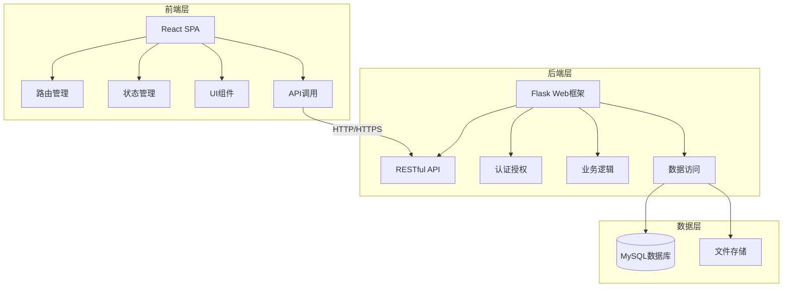
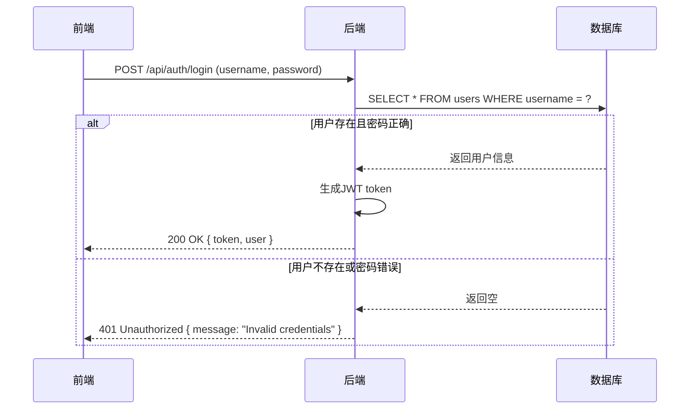
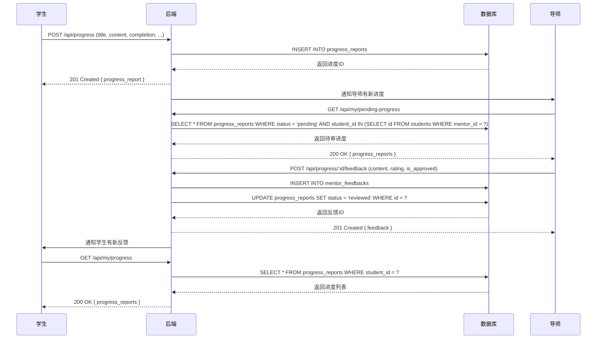

# 计算机实验室管理系统 - 技术架构文档

## 1. 系统架构概述

本系统采用前后端分离的架构设计，通过RESTful API实现前后端通信。系统主要分为前端层、后端层和数据层三个部分，各层之间通过明确的接口进行交互，保证了系统的可扩展性和可维护性。

### 1.1 架构图



## 2. 技术栈

### 2.1 前端技术栈

| 技术/框架 | 版本 | 用途 | 来源 |
|---------|------|------|------|
| React | 19.2.0 | 前端UI框架 | package.json |
| TypeScript | 5.9.3 | 类型安全 | package.json |
| Vite | 5.4.10 | 构建工具 | package.json |
| Tailwind CSS | 3.4.0 | 样式框架 | package.json |
| React Router | 6.30.3 | 路由管理 | package.json |
| Framer Motion | 12.34.3 | 动画效果 | package.json |
| Chart.js | 4.5.1 | 数据可视化 | package.json |
| React Icons | 5.5.0 | 图标库 | package.json |

### 2.2 后端技术栈

| 技术/框架 | 版本 | 用途 | 来源 |
|---------|------|------|------|
| Python | 3.9+ | 后端开发语言 | app.py |
| Flask | 2.0+ | Web框架 | app.py |
| Flask-RESTx | - | API文档 | app.py |
| Flask-SQLAlchemy | - | ORM | app.py |
| Flask-CORS | - | 跨域支持 | app.py |
| PyJWT | - | JWT认证 | app.py |
| Passlib | - | 密码加密 | app.py |
| MySQL | 8.0+ | 数据库 | app.py |

## 3. 目录结构

### 3.1 前端目录结构

```
frontend/
├── src/
│   ├── components/              # 组件目录
│   │   ├── common/              # 通用组件
│   │   │   ├── Button.tsx       # 按钮组件
│   │   │   ├── Card.tsx         # 卡片组件
│   │   │   ├── Form.tsx         # 表单组件
│   │   │   ├── Modal.tsx        # 模态框组件
│   │   │   ├── Navbar.tsx       # 导航栏组件
│   │   │   ├── ProtectedRoute.tsx # 路由保护组件
│   │   │   └── Timeline.tsx     # 时间线组件
│   │   ├── layout/              # 布局组件
│   │   │   ├── Footer.tsx       # 页脚组件
│   │   │   ├── Header.tsx       # 头部组件
│   │   │   └── Sidebar.tsx      # 侧边栏组件
│   │   ├── pages/               # 页面组件
│   │   │   ├── content/         # 内容管理页面
│   │   │   │   ├── AboutManagement.tsx     # 关于我们管理
│   │   │   │   ├── AchievementsManagement.tsx # 成果管理
│   │   │   │   ├── ContactManagement.tsx   # 联系管理
│   │   │   │   └── NewsManagement.tsx      # 新闻管理
│   │   │   ├── mentor/          # 导师页面
│   │   │   │   ├── MentorProfilePage.tsx   # 导师个人信息
│   │   │   │   ├── MyStudentsPage.tsx      # 我的学生
│   │   │   │   └── PendingProgressPage.tsx # 待审进度
│   │   │   ├── student/         # 学生页面
│   │   │   │   ├── ProgressPage.tsx        # 进度管理
│   │   │   │   └── StudentProfilePage.tsx  # 学生个人信息
│   │   │   ├── AboutPage.tsx    # 关于我们
│   │   │   ├── AchievementsPage.tsx # 研究成果
│   │   │   ├── ContactPage.tsx  # 联系方式
│   │   │   ├── ContentManagement.tsx # 内容管理
│   │   │   ├── HomePage.tsx     # 首页
│   │   │   ├── LoginPage.tsx    # 登录页面
│   │   │   ├── MentorManagement.tsx # 导师管理
│   │   │   ├── NewsPage.tsx     # 新闻公告
│   │   │   └── StudentManagement.tsx # 学生管理
│   │   └── ui/                  # UI组件
│   │       ├── AchievementCard.tsx    # 成果卡片
│   │       ├── DataVisualization.tsx  # 数据可视化
│   │       ├── HeroSection.tsx        # 英雄区
│   │       ├── NewsCard.tsx           # 新闻卡片
│   │       └── TeamMemberCard.tsx     # 团队成员卡片
│   ├── contexts/                # 上下文
│   │   └── AuthContext.tsx      # 认证上下文
│   ├── utils/                   # 工具函数
│   │   └── api.ts               # API调用
│   ├── App.css                  # 应用样式
│   ├── App.tsx                  # 应用入口
│   ├── index.css                # 全局样式
│   └── main.tsx                 # 主入口
├── public/                      # 静态资源
├── .vite/                       # Vite缓存
├── eslint.config.js             # ESLint配置
├── index.html                   # HTML模板
├── package.json                 # 依赖配置
├── package-lock.json            # 依赖锁定
├── postcss.config.js            # PostCSS配置
├── tailwind.config.js           # Tailwind配置
├── tsconfig.app.json            # TypeScript配置
├── tsconfig.json                # TypeScript配置
├── tsconfig.node.json           # TypeScript配置
└── vite.config.ts               # Vite配置
```

### 3.2 后端目录结构

```
backend/
├── app.py                       # 应用主文件
├── database.sql                 # 数据库初始化
├── requirements.txt             # 依赖配置
├── start_backend.bat            # 启动脚本（Windows）
├── start_backend.ps1            # 启动脚本（PowerShell）
└── .env                         # 环境变量
```

## 4. 核心功能模块

### 4.1 认证模块

**功能**：处理用户登录、登出和身份验证

**流程**：
1. 用户输入用户名和密码
2. 前端调用 `/api/auth/login` API
3. 后端验证用户名和密码
4. 生成JWT token并返回给前端
5. 前端存储token并用于后续请求

**关键实现**：
- JWT token生成与验证
- 密码加密存储
- 路由保护

### 4.2 学生管理模块

**功能**：管理学生信息，包括添加、编辑、删除学生，以及为学生分配导师

**流程**：
1. 管理员登录系统
2. 进入学生管理页面
3. 查看学生列表
4. 添加、编辑或删除学生
5. 为学生分配导师

**关键实现**：
- 学生CRUD操作
- 导师分配功能
- 权限控制

### 4.3 导师管理模块

**功能**：管理导师信息，包括添加、编辑、删除导师

**流程**：
1. 管理员登录系统
2. 进入导师管理页面
3. 查看导师列表
4. 添加、编辑或删除导师

**关键实现**：
- 导师CRUD操作
- 权限控制

### 4.4 课题进度模块

**功能**：学生提交课题进度，导师审阅和反馈

**流程**：
1. 学生登录系统
2. 进入课题进度页面
3. 提交新的进度
4. 导师收到通知
5. 导师审阅进度并提供反馈
6. 学生查看反馈

**关键实现**：
- 进度提交与更新
- 反馈管理
- 状态跟踪

### 4.5 内容管理模块

**功能**：管理实验室的新闻、成果、关于我们和联系方式等内容

**流程**：
1. 管理员登录系统
2. 进入内容管理页面
3. 选择要管理的内容类型
4. 添加、编辑或删除内容

**关键实现**：
- 内容CRUD操作
- 权限控制

## 5. 数据流

### 5.1 认证流程



### 5.2 进度提交与反馈流程



## 6. 数据库设计

### 6.1 表结构

#### 6.1.1 users表
| 字段名 | 类型 | 约束 | 说明 |
|--------|------|------|------|
| id | INT | PRIMARY KEY, AUTO_INCREMENT | 用户ID |
| username | VARCHAR(50) | UNIQUE, NOT NULL | 用户名/学号/工号 |
| password | VARCHAR(255) | NOT NULL | 密码（加密存储） |
| role | ENUM | NOT NULL | 角色：admin/mentor/student |
| email | VARCHAR(100) | UNIQUE | 邮箱 |
| phone | VARCHAR(20) | | 电话 |
| avatar | VARCHAR(255) | | 头像URL |
| created_at | DATETIME | DEFAULT CURRENT_TIMESTAMP | 创建时间 |
| updated_at | DATETIME | DEFAULT CURRENT_TIMESTAMP ON UPDATE | 更新时间 |

#### 6.1.2 mentors表
| 字段名 | 类型 | 约束 | 说明 |
|--------|------|------|------|
| id | INT | PRIMARY KEY, AUTO_INCREMENT | 导师ID |
| user_id | INT | UNIQUE, FOREIGN KEY | 关联用户ID |
| name | VARCHAR(50) | NOT NULL | 姓名 |
| title | VARCHAR(50) | | 职称 |
| department | VARCHAR(100) | | 部门 |
| research_direction | TEXT | | 研究方向 |
| bio | TEXT | | 个人简介 |
| created_at | DATETIME | DEFAULT CURRENT_TIMESTAMP | 创建时间 |
| updated_at | DATETIME | DEFAULT CURRENT_TIMESTAMP ON UPDATE | 更新时间 |

#### 6.1.3 students表
| 字段名 | 类型 | 约束 | 说明 |
|--------|------|------|------|
| id | INT | PRIMARY KEY, AUTO_INCREMENT | 学生ID |
| user_id | INT | UNIQUE, FOREIGN KEY | 关联用户ID |
| mentor_id | INT | FOREIGN KEY | 导师ID |
| name | VARCHAR(50) | NOT NULL | 姓名 |
| student_no | VARCHAR(20) | UNIQUE, NOT NULL | 学号 |
| gender | VARCHAR(10) | | 性别 |
| grade | VARCHAR(10) | | 年级 |
| student_type | VARCHAR(20) | | 学生类型 |
| major | VARCHAR(100) | | 专业 |
| research_topic | VARCHAR(200) | | 研究课题 |
| enrollment_date | DATE | | 入学日期 |
| bio | TEXT | | 个人简介 |
| created_at | DATETIME | DEFAULT CURRENT_TIMESTAMP | 创建时间 |
| updated_at | DATETIME | DEFAULT CURRENT_TIMESTAMP ON UPDATE | 更新时间 |

#### 6.1.4 progress_reports表
| 字段名 | 类型 | 约束 | 说明 |
|--------|------|------|------|
| id | INT | PRIMARY KEY, AUTO_INCREMENT | 进度ID |
| student_id | INT | FOREIGN KEY | 学生ID |
| title | VARCHAR(200) | NOT NULL | 进度标题 |
| content | TEXT | NOT NULL | 进度内容 |
| completion | INT | NOT NULL | 完成度 (0-100) |
| problems | TEXT | | 遇到的问题 |
| next_plan | TEXT | | 下一步计划 |
| status | ENUM | DEFAULT 'pending' | 状态：pending/reviewed |
| created_at | DATETIME | DEFAULT CURRENT_TIMESTAMP | 提交时间 |
| updated_at | DATETIME | DEFAULT CURRENT_TIMESTAMP ON UPDATE | 更新时间 |

#### 6.1.5 mentor_feedbacks表
| 字段名 | 类型 | 约束 | 说明 |
|--------|------|------|------|
| id | INT | PRIMARY KEY, AUTO_INCREMENT | 反馈ID |
| progress_id | INT | UNIQUE, FOREIGN KEY | 进度ID |
| mentor_id | INT | FOREIGN KEY | 导师ID |
| content | TEXT | NOT NULL | 反馈内容 |
| rating | INT | | 评分 (1-5) |
| is_approved | BOOLEAN | DEFAULT TRUE | 是否通过 |
| created_at | DATETIME | DEFAULT CURRENT_TIMESTAMP | 创建时间 |
| updated_at | DATETIME | DEFAULT CURRENT_TIMESTAMP ON UPDATE | 更新时间 |

#### 6.1.6 progress_attachments表
| 字段名 | 类型 | 约束 | 说明 |
|--------|------|------|------|
| id | INT | PRIMARY KEY, AUTO_INCREMENT | 附件ID |
| progress_id | INT | FOREIGN KEY | 进度ID |
| file_name | VARCHAR(255) | NOT NULL | 文件名 |
| file_path | VARCHAR(255) | NOT NULL | 文件路径 |
| file_size | BIGINT | | 文件大小（字节） |
| file_type | VARCHAR(50) | | 文件类型 |
| created_at | DATETIME | DEFAULT CURRENT_TIMESTAMP | 上传时间 |

#### 6.1.7 news表
| 字段名 | 类型 | 约束 | 说明 |
|--------|------|------|------|
| id | INT | PRIMARY KEY, AUTO_INCREMENT | 新闻ID |
| title | VARCHAR(200) | NOT NULL | 标题 |
| content | TEXT | NOT NULL | 内容 |
| category | VARCHAR(50) | | 分类 |
| cover_image | VARCHAR(255) | | 封面图 |
| author_id | INT | FOREIGN KEY | 作者ID |
| is_published | BOOLEAN | DEFAULT FALSE | 是否发布 |
| published_at | DATETIME | | 发布时间 |
| created_at | DATETIME | DEFAULT CURRENT_TIMESTAMP | 创建时间 |
| updated_at | DATETIME | DEFAULT CURRENT_TIMESTAMP ON UPDATE | 更新时间 |

#### 6.1.8 achievements表
| 字段名 | 类型 | 约束 | 说明 |
|--------|------|------|------|
| id | INT | PRIMARY KEY, AUTO_INCREMENT | 成果ID |
| title | VARCHAR(200) | NOT NULL | 标题 |
| description | TEXT | | 描述 |
| type | ENUM | NOT NULL | 类型：paper/project/award/patent |
| authors | VARCHAR(500) | | 作者/完成人 |
| year | INT | | 年份 |
| link | VARCHAR(255) | | 链接 |
| cover_image | VARCHAR(255) | | 封面图 |
| created_at | DATETIME | DEFAULT CURRENT_TIMESTAMP | 创建时间 |
| updated_at | DATETIME | DEFAULT CURRENT_TIMESTAMP ON UPDATE | 更新时间 |

## 7. API接口

### 7.1 认证相关API

| 方法 | 路径 | 描述 | 请求参数 | 响应 |
|------|------|------|----------|------|
| POST | /api/auth/login | 用户登录 | {username, password} | {token, user} |
| GET | /api/auth/me | 获取当前用户信息 | - | {user} |

### 7.2 学生管理API

| 方法 | 路径 | 描述 | 请求参数 | 响应 |
|------|------|------|----------|------|
| GET | /api/students | 获取学生列表 | [mentor_id] | [{student}] |
| POST | /api/students | 创建学生 | {username, password, name, student_no, ...} | {student} |
| GET | /api/students/:id | 获取学生详情 | - | {student} |
| PUT | /api/students/:id | 更新学生信息 | {name, student_no, ...} | {student} |
| PUT | /api/students/:id/assign-mentor | 分配导师 | {mentor_id} | {student} |

### 7.3 导师管理API

| 方法 | 路径 | 描述 | 请求参数 | 响应 |
|------|------|------|----------|------|
| GET | /api/mentors | 获取导师列表 | - | [{mentor}] |
| POST | /api/mentors | 创建导师 | {username, password, name, title, ...} | {mentor} |
| GET | /api/mentors/:id | 获取导师详情 | - | {mentor} |
| PUT | /api/mentors/:id | 更新导师信息 | {name, title, ...} | {mentor} |
| GET | /api/mentors/:id/students | 获取导师的学生列表 | - | [{student}] |

### 7.4 我的学生API（导师专属）

| 方法 | 路径 | 描述 | 请求参数 | 响应 |
|------|------|------|----------|------|
| GET | /api/my/students | 获取我的学生列表 | - | [{student}] |
| GET | /api/my/students/:id | 获取学生详情和进度历史 | - | {student, progress_history} |

### 7.5 课题进度API

| 方法 | 路径 | 描述 | 请求参数 | 响应 |
|------|------|------|----------|------|
| POST | /api/progress | 提交进度 | {title, content, completion, problems, next_plan} | {progress_report} |
| GET | /api/my/progress | 获取我的进度（学生） | - | [{progress_report}] |
| GET | /api/my/pending-progress | 获取待审进度（导师） | - | [{progress_report}] |
| GET | /api/progress/:id | 获取进度详情 | - | {progress, feedback} |
| PUT | /api/progress/:id | 更新进度 | {title, content, ...} | {progress_report} |
| POST | /api/progress/:id/feedback | 提交反馈 | {content, rating, is_approved} | {feedback} |
| GET | /api/progress/:id/feedback | 获取反馈 | - | {feedback} |

## 8. 安全措施

### 8.1 认证与授权

- 使用JWT进行身份认证
- 密码使用bcrypt加密存储
- 路由保护，确保只有授权用户能访问特定资源
- 基于角色的权限控制

### 8.2 数据安全

- 防止SQL注入攻击
- 防止XSS攻击
- 敏感操作需要二次确认
- 定期数据备份

### 8.3 传输安全

- 使用HTTPS传输数据
- API请求验证token

## 9. 性能优化

### 9.1 前端优化

- 使用Vite进行构建，提高开发和构建速度
- 组件懒加载，减少初始加载时间
- 图片优化，使用适当的格式和大小
- 减少不必要的重渲染

### 9.2 后端优化

- 数据库查询优化
- 使用缓存减少数据库访问
- 异步处理耗时操作
- API响应时间优化

## 10. 部署与维护

### 10.1 部署环境

- 前端：静态文件部署到CDN或服务器
- 后端：部署到云服务器或容器平台
- 数据库：使用MySQL数据库服务

### 10.2 维护策略

- 定期更新依赖包
- 监控系统运行状态
- 日志记录与分析
- 定期安全审计

## 11. 总结

本系统采用前后端分离的架构设计，使用现代技术栈实现了一个功能完整的计算机实验室管理系统。系统具有良好的可扩展性、可维护性和安全性，能够满足实验室管理的各种需求。通过明确的模块划分和接口设计，系统各部分能够独立开发和测试，提高了开发效率。

未来可以考虑添加更多功能，如项目管理、论文管理、实验室资源预约等，进一步提升系统的实用性和价值。