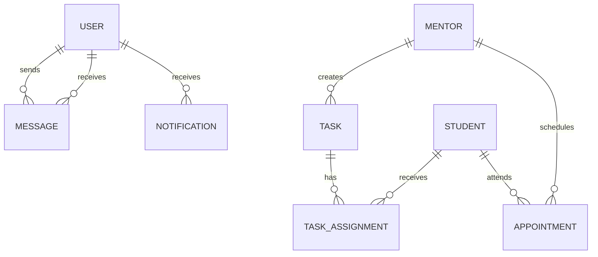

# 导师端功能规划文档

## 1. 概述

本文档详细规划了计算机实验室管理系统导师端的功能模块，重点加强导师与学生的交流、学生情况监控、指导管理等核心功能。

## 2. 现有功能分析

### 2.1 当前已实现功能

| 功能模块 | 功能描述 | 状态 |
|---------|---------|------|
| 我的学生 | 查看所指导学生列表和基本信息 | ✅ 已实现 |
| 待审进度 | 审阅学生提交的课题进度报告 | ✅ 已实现 |
| 导师信息 | 查看和管理个人信息 | ✅ 已实现 |

### 2.2 功能缺口分析

当前系统缺少以下关键功能：
- 师生实时/异步消息交流
- 学生成长轨迹可视化
- 任务/作业布置与管理
- 预约会面功能
- 成果指导与审核
- 数据统计与分析
- 通知提醒系统

## 3. 功能模块规划

### 3.1 导师工作台（Dashboard）

#### 功能描述
导师登录后的首页，展示关键数据概览和快捷入口。

#### 功能点
- **数据看板**
  - 待审进度数量
  - 未读消息数量
  - 本周会面预约
  - 学生整体进度统计
  
- **快捷操作**
  - 快速发送消息
  - 快速查看待审
  - 快速安排会面
  
- **最新动态**
  - 学生最近提交的进度
  - 学生最新消息
  - 系统通知

#### 界面设计原则
- 玻璃拟态风格
- 弹簧阻尼动画
- 数据可视化（图表）

---

### 3.2 学生管理（Students）

#### 功能描述
全面管理和查看所指导学生的详细信息。

#### 功能点
- **学生列表**
  - 卡片式/列表式切换
  - 搜索和筛选（年级、专业、状态）
  - 学生状态标签（活跃/需关注/滞后）
  
- **学生详情页**
  - 基本信息展示
  - 研究课题详情
  - 进度时间线
  - 成长轨迹图
  - 消息记录
  - 会面记录
  - 成果列表
  
- **学生状态评估**
  - 自动评估学生状态
  - 基于进度提交频率、完成度等指标
  - 需关注学生预警

---

### 3.3 进度管理（Progress）

#### 功能描述
管理和审阅学生的课题进度报告。

#### 功能点
- **进度列表**
  - 待审进度
  - 已审进度
  - 全部进度
  - 按学生筛选
  - 按时间筛选
  
- **进度审阅**
  - 详细查看进度内容
  - 查看附件
  - 在线批注
  - 撰写反馈（支持富文本）
  - 评分（1-5星）
  - 通过/需修改选择
  - 模板化反馈（常用评语）

- **进度统计**
  - 学生个人进度趋势
  - 整体进度统计
  - 完成度分布

---

### 3.4 师生交流（Messages）

#### 功能描述
导师与学生之间的消息交流系统。

#### 功能点
- **消息列表**
  - 会话列表（按学生分组）
  - 未读消息标识
  - 最后消息预览
  - 时间显示
  
- **消息对话框**
  - 实时消息发送
  - 支持文本、图片、文件
  - 消息状态（已发送/已读）
  - 消息时间线
  - 快捷回复（常用语）
  
- **消息管理**
  - 搜索消息历史
  - 消息标记（重要/待处理）
  - 消息归档

#### 数据库扩展
需要新增 `messages` 表：

| 字段 | 类型 | 描述 |
|-----|------|------|
| id | INT | 消息ID |
| sender_id | INT | 发送者ID |
| receiver_id | INT | 接收者ID |
| content | TEXT | 消息内容 |
| message_type | ENUM | 消息类型（text/image/file） |
| file_url | VARCHAR | 文件URL（如果有） |
| is_read | BOOLEAN | 是否已读 |
| created_at | DATETIME | 发送时间 |

---

### 3.5 任务管理（Tasks）

#### 功能描述
导师给学生布置任务/作业，并跟踪完成情况。

#### 功能点
- **任务列表**
  - 全部任务
  - 进行中任务
  - 已完成任务
  - 逾期任务
  
- **创建任务**
  - 任务标题
  - 任务描述
  - 关联学生（多选）
  - 截止日期
  - 优先级
  - 附件上传
  - 任务模板（复用）

- **任务跟踪**
  - 任务状态查看
  - 学生提交查看
  - 任务评价
  - 完成率统计

#### 数据库扩展
需要新增 `tasks` 表：

| 字段 | 类型 | 描述 |
|-----|------|------|
| id | INT | 任务ID |
| mentor_id | INT | 导师ID |
| title | VARCHAR | 任务标题 |
| description | TEXT | 任务描述 |
| priority | ENUM | 优先级（low/medium/high） |
| due_date | DATETIME | 截止日期 |
| created_at | DATETIME | 创建时间 |

需要新增 `task_assignments` 表：

| 字段 | 类型 | 描述 |
|-----|------|------|
| id | INT | 分配ID |
| task_id | INT | 任务ID |
| student_id | INT | 学生ID |
| status | ENUM | 状态（pending/submitted/completed） |
| submitted_at | DATETIME | 提交时间 |
| submission_content | TEXT | 提交内容 |
| feedback | TEXT | 导师反馈 |
| feedback_at | DATETIME | 反馈时间 |

---

### 3.6 会面预约（Appointments）

#### 功能描述
导师与学生预约线下或线上会面。

#### 功能点
- **日历视图**
  - 月/周/日视图切换
  - 已有会面显示
  - 可用时间标记
  - 冲突检测
  
- **预约管理**
  - 创建预约（选择学生、时间、地点）
  - 预约类型（线上/线下）
  - 预约主题
  - 预约说明
  - 发送邀请通知
  
- **会面记录**
  - 历史会面记录
  - 会面纪要
  - 下次待办

#### 数据库扩展
需要新增 `appointments` 表：

| 字段 | 类型 | 描述 |
|-----|------|------|
| id | INT | 预约ID |
| mentor_id | INT | 导师ID |
| student_id | INT | 学生ID |
| title | VARCHAR | 预约主题 |
| description | TEXT | 预约说明 |
| appointment_type | ENUM | 类型（online/offline） |
| location | VARCHAR | 地点 |
| start_time | DATETIME | 开始时间 |
| end_time | DATETIME | 结束时间 |
| status | ENUM | 状态（pending/confirmed/cancelled/completed） |
| notes | TEXT | 会面纪要 |
| created_at | DATETIME | 创建时间 |

---

### 3.7 成果指导（Achievements）

#### 功能描述
指导学生的科研成果，包括论文、项目、专利等。

#### 功能点
- **成果列表**
  - 按类型筛选（论文/项目/专利/奖项）
  - 按学生筛选
  - 按时间排序
  
- **成果详情**
  - 成果基本信息
  - 学生贡献
  - 指导记录
  - 相关文件
  
- **成果审核**
  - 审核学生提交的成果
  - 提供修改建议
  - 推荐发表/申报

---

### 3.8 通知中心（Notifications）

#### 功能描述
系统通知和提醒功能。

#### 功能点
- **通知列表**
  - 全部通知
  - 未读通知
  - 按类型筛选（进度/消息/预约/系统）
  
- **通知类型**
  - 学生提交进度通知
  - 新消息通知
  - 预约提醒
  - 任务截止提醒
  - 系统公告
  
- **通知设置**
  - 推送开关
  - 邮件通知开关
  - 提醒时间设置

#### 数据库扩展
需要新增 `notifications` 表：

| 字段 | 类型 | 描述 |
|-----|------|------|
| id | INT | 通知ID |
| user_id | INT | 接收用户ID |
| title | VARCHAR | 通知标题 |
| content | TEXT | 通知内容 |
| type | ENUM | 通知类型 |
| related_id | INT | 关联ID |
| is_read | BOOLEAN | 是否已读 |
| created_at | DATETIME | 创建时间 |

---

### 3.9 数据统计（Analytics）

#### 功能描述
导师指导学生的数据统计和分析。

#### 功能点
- **学生统计**
  - 学生数量趋势
  - 学生构成（年级、专业）
  - 毕业/入学统计
  
- **进度统计**
  - 整体完成度分布
  - 平均反馈时间
  - 进度提交频率
  
- **成果统计**
  - 成果数量统计
  - 成果类型分布
  - 年度对比

- **可视化图表**
  - 柱状图
  - 折线图
  - 饼图
  - 热力图

---

### 3.10 个人中心（Profile）

#### 功能描述
导师个人信息管理。

#### 功能点
- **基本信息**
  - 查看个人信息
  - 编辑个人信息
  - 头像上传
  
- **研究方向**
  - 管理研究方向
  - 添加/删除研究方向
  
- **联系方式**
  - 办公地点
  - 办公时间
  - 联系电话

---

## 4. 导航结构

```
导师中心
├── 工作台 (Dashboard)
├── 我的学生 (Students)
│   ├── 学生列表
│   └── 学生详情
├── 进度管理 (Progress)
│   ├── 待审进度
│   ├── 已审进度
│   └── 进度统计
├── 师生交流 (Messages)
│   ├── 消息列表
│   └── 消息对话框
├── 任务管理 (Tasks)
│   ├── 任务列表
│   ├── 创建任务
│   └── 任务跟踪
├── 会面预约 (Appointments)
│   ├── 日历视图
│   ├── 预约管理
│   └── 会面记录
├── 成果指导 (Achievements)
│   ├── 成果列表
│   └── 成果审核
├── 数据统计 (Analytics)
│   ├── 学生统计
│   ├── 进度统计
│   └── 成果统计
└── 个人中心 (Profile)
    ├── 基本信息
    └── 联系方式
```

---

## 5. 数据库扩展设计

### 5.1 新增表汇总

| 表名 | 用途 |
|-----|------|
| messages | 师生消息 |
| tasks | 导师布置的任务 |
| task_assignments | 任务分配与提交 |
| appointments | 会面预约 |
| notifications | 系统通知 |

### 5.2 ER图扩展



---

## 6. 实现优先级

### 第一阶段（核心功能）
1. 导师工作台
2. 师生消息交流
3. 学生管理增强（成长轨迹）
4. 通知中心

### 第二阶段（重要功能）
1. 任务管理
2. 会面预约
3. 进度管理增强（批注、模板）

### 第三阶段（增强功能）
1. 成果指导
2. 数据统计与分析
3. 高级可视化

---

## 7. 设计规范

### 7.1 UI/UX 原则
- 玻璃拟态风格
- 弹簧阻尼物理动画
- 响应式设计
- 直观的操作流程
- 及时的反馈提示

### 7.2 技术栈
- 前端：React + TypeScript + Tailwind CSS + Framer Motion
- 后端：Flask + SQLAlchemy
- 数据库：SQLite（开发）/ MySQL（生产）
- 图表：ECharts / Chart.js

---

## 8. 总结

本规划文档详细设计了导师端的完整功能模块，重点解决了师生交流、学生管理、任务布置等核心需求。通过分阶段实施，可以逐步完善系统功能，提升导师的工作效率和学生的培养质量。
