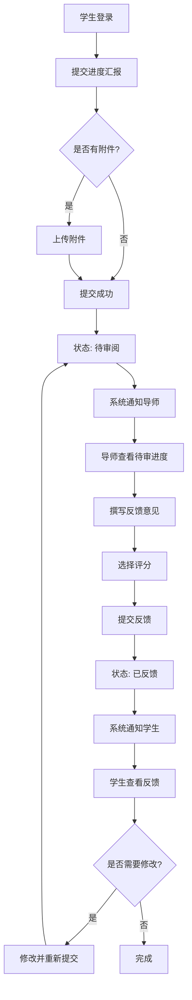
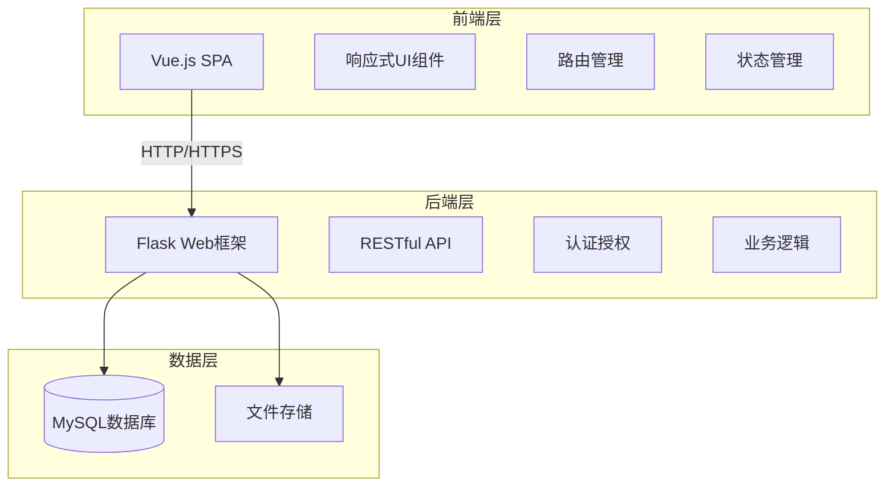

# 计算机实验室管理系统 - 产品需求文档 (PRD)

## 文档信息
| 项目 | 内容 |
|------|------|
| 产品名称 | 计算机实验室管理系统 |
| 文档版本 | v2.0 |
| 创建日期 | 2026-03-02 |
| 技术架构 | 前后端分离（Python Flask + Vue.js） |

---

## 1. 产品概览

计算机学院实验室管理系统是一个综合性平台，用于管理实验室的学生、导师、项目、新闻和成果等信息。

- 该系统旨在为实验室提供一个集中化的管理平台，方便管理员、导师和学生进行信息管理和查看。
- 系统将支持管理员对页面内容的修改，导师对学生的管理，以及学生对个人信息的查看和更新。

### 1.1 目标用户群体

| 用户角色 | 用户画像 | 核心痛点 |
|---------|---------|---------|
| **管理员** | 实验室行政人员，负责日常管理 | 信息分散，难以统一管理；导师和学生信息维护困难 |
| **导师** | 实验室研究人员，指导多名学生 | 难以跟踪多个学生的研究进度；缺乏系统化的进度管理工具 |
| **学生** | 实验室研究生/本科生，参与科研项目 | 进度汇报不规范；难以查看历史进度和导师反馈 |
| **访客** | 对实验室感兴趣的外部人员 | 信息获取渠道分散 |

### 1.2 产品愿景

构建一个高效、易用、一体化的实验室管理平台，提升科研管理效率，促进学术交流。

---

## 2. 用户故事

### 2.1 管理员相关

| ID | 用户故事 | 优先级 | 验收标准 |
|----|---------|--------|---------|
| US-001 | 作为管理员，我希望能够创建和管理导师账号，以便导师可以登录系统 | 高 | 可以创建、编辑、删除、查询导师信息 |
| US-002 | 作为管理员，我希望能够创建和管理学生账号，以便学生可以登录系统 | 高 | 可以创建、编辑、删除、查询学生信息 |
| US-003 | 作为管理员，我希望能够将学生分配给指定导师，以便建立指导关系 | 高 | 可以为学生分配和更换导师 |
| US-004 | 作为管理员，我希望能够发布和管理新闻公告，以便实验室成员了解最新动态 | 中 | 可以发布、编辑、删除新闻 |
| US-005 | 作为管理员，我希望能够发布和管理研究成果，以便展示实验室的学术成就 | 中 | 可以发布、编辑、删除成果 |

### 2.2 导师相关

| ID | 用户故事 | 优先级 | 验收标准 |
|----|---------|--------|---------|
| US-101 | 作为导师，我希望能够查看我指导的学生列表，以便了解我的学生情况 | 高 | 可以看到完整的学生列表，包含基本信息 |
| US-102 | 作为导师，我希望能够查看学生的详细信息，以便全面了解学生 | 高 | 可以查看学生的个人信息、研究方向、进度历史 |
| US-103 | 作为导师，我希望能够查看学生提交的课题进度，以便跟踪研究进展 | 高 | 可以查看所有学生的最新进度 |
| US-104 | 作为导师，我希望能够对学生的进度汇报进行反馈，以便指导学生 | 高 | 可以撰写、编辑、删除反馈意见 |
| US-105 | 作为导师，我希望能够查看学生的进度历史，以便了解研究的整体脉络 | 中 | 可以按时间倒序查看所有历史进度 |
| US-106 | 作为导师，我希望能够编辑自己的个人信息，以便保持信息更新 | 中 | 可以修改个人简介、研究方向等信息 |

### 2.3 学生相关

| ID | 用户故事 | 优先级 | 验收标准 |
|----|---------|--------|---------|
| US-201 | 作为学生，我希望能够提交课题进度汇报，以便让导师了解我的研究进展 | 高 | 可以撰写并提交进度报告，包含文字、图片、附件 |
| US-202 | 作为学生，我希望能够查看我的进度历史，以便回顾自己的研究历程 | 高 | 可以按时间查看所有提交过的进度 |
| US-203 | 作为学生，我希望能够查看导师对我进度的反馈，以便改进研究工作 | 高 | 可以看到导师对每条进度的具体反馈 |
| US-204 | 作为学生，我希望能够编辑自己的个人信息，以便保持信息更新 | 中 | 可以修改个人简介、研究方向等信息 |
| US-205 | 作为学生，我希望能够查看我的导师信息，以便了解导师的研究方向 | 中 | 可以查看导师的基本信息 |

---

## 3. 核心功能

### 3.1 用户角色
| 角色 | 注册方式 | 核心权限 |
|------|----------|----------|
| 管理员 | 系统预设 | 管理所有内容，包括学生、导师、新闻、成果等 |
| 导师 | 管理员创建 | 管理自己的学生，查看和更新个人信息，审阅学生进度 |
| 学生 | 管理员创建 | 查看和更新个人信息，提交课题进度，查看导师反馈 |

### 3.2 功能模块

我们的实验室管理系统包含以下主要页面：
1. **首页**：展示实验室概况、最新新闻和成果。
2. **关于我们**：介绍实验室历史、团队和研究方向。
3. **研究成果**：展示实验室的论文、项目、获奖和专利。
4. **新闻公告**：发布和展示实验室的新闻和活动。
5. **联系方式**：提供实验室的联系信息和留言功能。
6. **学生管理**：管理学生信息，包括添加、编辑、删除学生账号。
7. **导师管理**：管理导师信息，包括添加、编辑、删除导师账号。
8. **我的学生**（导师专属）：导师管理自己的学生。
9. **课题进度**：学生提交进度，导师审阅进度。
10. **登录页面**：用户登录入口。

### 3.3 页面详情

| 页面名称 | 模块名称 | 功能描述 |
|----------|----------|----------|
| 首页 | 英雄区 | 展示实验室名称和简介，提供快速导航链接。 |
| 首页 | 实验室简介 | 简要介绍实验室的历史和研究方向。 |
| 首页 | 最新动态 | 展示最新的新闻和活动。 |
| 首页 | 核心成果 | 展示实验室的重要成果。 |
| 首页 | 研究方向 | 展示实验室的主要研究方向。 |
| 首页 | 团队成员 | 展示实验室的核心团队成员。 |
| 关于我们 | 实验室简介 | 详细介绍实验室的历史、使命和愿景。 |
| 关于我们 | 实验室历史 | 展示实验室的发展历程。 |
| 关于我们 | 研究方向 | 详细介绍实验室的研究方向和成果。 |
| 关于我们 | 团队成员 | 展示实验室的所有团队成员。 |
| 研究成果 | 成果统计 | 展示实验室的成果统计数据。 |
| 研究成果 | 成果列表 | 展示实验室的所有成果，支持分类查看。 |
| 新闻公告 | 新闻筛选 | 支持按分类筛选新闻。 |
| 新闻公告 | 新闻列表 | 展示实验室的所有新闻。 |
| 联系方式 | 联系信息 | 展示实验室的联系信息和位置。 |
| 联系方式 | 留言表单 | 提供留言功能，方便访客联系实验室。 |
| 学生管理 | 学生列表 | 展示所有学生信息，支持搜索和筛选。 |
| 学生管理 | 学生详情 | 查看和编辑学生详细信息，分配导师。 |
| 学生管理 | 添加学生 | 添加新的学生账号。 |
| 导师管理 | 导师列表 | 展示所有导师信息，支持搜索和筛选。 |
| 导师管理 | 导师详情 | 查看和编辑导师详细信息。 |
| 导师管理 | 添加导师 | 添加新的导师账号。 |
| 我的学生 | 学生列表 | 导师查看自己指导的学生列表。 |
| 我的学生 | 学生详情 | 导师查看学生详细信息和进度历史。 |
| 课题进度 | 进度提交 | 学生提交新的课题进度汇报。 |
| 课题进度 | 进度列表 | 学生查看自己的进度历史。 |
| 课题进度 | 进度详情 | 查看进度详情和导师反馈。 |
| 课题进度 | 待审进度 | 导师查看待审阅的学生进度。 |
| 课题进度 | 反馈撰写 | 导师对学生进度撰写反馈意见。 |
| 登录页面 | 登录表单 | 用户登录入口，支持不同角色的登录。 |

---

## 4. 功能详细设计

### 4.1 导师管理学生功能

#### 4.1.1 学生分配（管理员）

**功能描述**：管理员可以为学生分配导师，也可以更换学生的导师。

**业务规则**：
- 一个学生只能有一个指导导师
- 一个导师可以指导多名学生
- 分配导师时需要记录分配时间

**交互流程**：
1. 管理员进入学生详情页
2. 点击"分配导师"按钮
3. 在弹出的导师选择器中选择导师
4. 确认分配，系统记录分配关系

**UI元素**：
- 导师选择下拉框（搜索 + 列表）
- 确认/取消按钮
- 当前导师信息展示

#### 4.1.2 查看学生列表（导师）

**功能描述**：导师可以查看自己指导的所有学生列表。

**业务规则**：
- 只显示该导师指导的学生
- 支持按姓名、学号搜索
- 显示学生基本信息（姓名、学号、年级、研究方向）
- 显示最近进度提交时间

**交互流程**：
1. 导师登录后点击"我的学生"
2. 系统展示学生列表
3. 可以使用搜索框筛选学生
4. 点击学生卡片进入详情页

**UI元素**：
- 搜索框
- 学生卡片列表（头像、姓名、学号、研究方向、最近进度）
- 分页控件

#### 4.1.3 查看学生详细信息（导师）

**功能描述**：导师可以查看学生的详细信息，包括个人信息、研究方向、进度历史等。

**业务规则**：
- 只能查看自己指导的学生的详细信息
- 显示学生基本信息（姓名、学号、年级、入学时间、邮箱、电话）
- 显示研究方向和课题名称
- 显示进度时间线
- 可以直接跳转到某条进度详情

**UI元素**：
- 学生头像和基本信息卡片
- 研究信息模块
- 进度时间线组件
- 快速操作按钮

### 4.2 学生课题进度汇报功能

#### 4.2.1 进度提交（学生）

**功能描述**：学生可以提交课题进度汇报，记录研究进展。

**业务规则**：
- 进度汇报包含：标题、内容（富文本）、完成度（0-100%）、遇到的问题、下一步计划
- 支持上传附件（图片、文档等）
- 提交后状态为"待审阅"
- 学生可以在导师反馈前编辑已提交的进度

**交互流程**：
1. 学生进入"课题进度"页面
2. 点击"提交进度"按钮
3. 填写进度表单
4. 上传附件（可选）
5. 预览并提交
6. 系统发送通知给导师

**UI元素**：
- 进度标题输入框
- 富文本编辑器（内容）
- 完成度滑块（0-100%）
- 问题描述输入框
- 下一步计划输入框
- 附件上传区域
- 提交/保存草稿按钮

#### 4.2.2 进度历史查看（学生/导师）

**功能描述**：学生和导师可以查看历史进度记录。

**业务规则**：
- 按时间倒序排列
- 显示每条进度的标题、提交时间、状态、完成度
- 导师可以看到所有学生的进度
- 学生只能看到自己的进度
- 支持按时间范围筛选

**UI元素**：
- 时间筛选器
- 进度卡片列表
- 状态标签（待审阅、已反馈、已修改）
- 进度详情入口

#### 4.2.3 导师反馈（导师）

**功能描述**：导师可以对学生的进度汇报进行反馈和评价。

**业务规则**：
- 反馈包含：评价内容（富文本）、评分（1-5星）、是否通过
- 导师可以多次编辑反馈
- 学生提交新进度或修改进度后，状态重置为"待审阅"
- 提交反馈后系统通知学生

**交互流程**：
1. 导师进入"待审进度"列表
2. 点击某条进度查看详情
3. 阅读学生进度内容
4. 填写反馈表单
5. 选择评分和是否通过
6. 提交反馈

**UI元素**：
- 学生进度内容展示区
- 反馈富文本编辑器
- 星级评分组件
- 通过/需修改选项
- 提交反馈按钮

---

## 5. 数据库设计

### 5.1 用户表 (users)

| 字段名 | 类型 | 约束 | 说明 |
|--------|------|------|------|
| id | INT | PRIMARY KEY, AUTO_INCREMENT | 用户ID |
| username | VARCHAR(50) | UNIQUE, NOT NULL | 用户名/学号/工号 |
| password | VARCHAR(255) | NOT NULL | 密码（加密存储） |
| role | ENUM | NOT NULL | 角色：admin/mentor/student |
| email | VARCHAR(100) | UNIQUE | 邮箱 |
| phone | VARCHAR(20) | | 电话 |
| avatar | VARCHAR(255) | | 头像URL |
| created_at | DATETIME | DEFAULT CURRENT_TIMESTAMP | 创建时间 |
| updated_at | DATETIME | DEFAULT CURRENT_TIMESTAMP ON UPDATE | 更新时间 |

### 5.2 导师信息表 (mentors)

| 字段名 | 类型 | 约束 | 说明 |
|--------|------|------|------|
| id | INT | PRIMARY KEY, AUTO_INCREMENT | 导师ID |
| user_id | INT | UNIQUE, FOREIGN KEY | 关联用户ID |
| name | VARCHAR(50) | NOT NULL | 姓名 |
| title | VARCHAR(50) | | 职称 |
| research_direction | TEXT | | 研究方向 |
| bio | TEXT | | 个人简介 |
| created_at | DATETIME | DEFAULT CURRENT_TIMESTAMP | 创建时间 |
| updated_at | DATETIME | DEFAULT CURRENT_TIMESTAMP ON UPDATE | 更新时间 |

### 5.3 学生信息表 (students)

| 字段名 | 类型 | 约束 | 说明 |
|--------|------|------|------|
| id | INT | PRIMARY KEY, AUTO_INCREMENT | 学生ID |
| user_id | INT | UNIQUE, FOREIGN KEY | 关联用户ID |
| mentor_id | INT | FOREIGN KEY | 导师ID |
| name | VARCHAR(50) | NOT NULL | 姓名 |
| student_no | VARCHAR(20) | UNIQUE, NOT NULL | 学号 |
| grade | VARCHAR(10) | | 年级 |
| enrollment_date | DATE | | 入学日期 |
| research_topic | VARCHAR(200) | | 研究课题 |
| bio | TEXT | | 个人简介 |
| created_at | DATETIME | DEFAULT CURRENT_TIMESTAMP | 创建时间 |
| updated_at | DATETIME | DEFAULT CURRENT_TIMESTAMP ON UPDATE | 更新时间 |

### 5.4 课题进度表 (progress_reports)

| 字段名 | 类型 | 约束 | 说明 |
|--------|------|------|------|
| id | INT | PRIMARY KEY, AUTO_INCREMENT | 进度ID |
| student_id | INT | FOREIGN KEY | 学生ID |
| title | VARCHAR(200) | NOT NULL | 进度标题 |
| content | TEXT | NOT NULL | 进度内容 |
| completion | INT | NOT NULL | 完成度 (0-100) |
| problems | TEXT | | 遇到的问题 |
| next_plan | TEXT | | 下一步计划 |
| status | ENUM | DEFAULT 'pending' | 状态：pending/reviewed |
| created_at | DATETIME | DEFAULT CURRENT_TIMESTAMP | 提交时间 |
| updated_at | DATETIME | DEFAULT CURRENT_TIMESTAMP ON UPDATE | 更新时间 |

### 5.5 导师反馈表 (mentor_feedbacks)

| 字段名 | 类型 | 约束 | 说明 |
|--------|------|------|------|
| id | INT | PRIMARY KEY, AUTO_INCREMENT | 反馈ID |
| progress_id | INT | UNIQUE, FOREIGN KEY | 进度ID |
| mentor_id | INT | FOREIGN KEY | 导师ID |
| content | TEXT | NOT NULL | 反馈内容 |
| rating | INT | | 评分 (1-5) |
| is_approved | BOOLEAN | DEFAULT TRUE | 是否通过 |
| created_at | DATETIME | DEFAULT CURRENT_TIMESTAMP | 创建时间 |
| updated_at | DATETIME | DEFAULT CURRENT_TIMESTAMP ON UPDATE | 更新时间 |

### 5.6 进度附件表 (progress_attachments)

| 字段名 | 类型 | 约束 | 说明 |
|--------|------|------|------|
| id | INT | PRIMARY KEY, AUTO_INCREMENT | 附件ID |
| progress_id | INT | FOREIGN KEY | 进度ID |
| file_name | VARCHAR(255) | NOT NULL | 文件名 |
| file_path | VARCHAR(255) | NOT NULL | 文件路径 |
| file_size | BIGINT | | 文件大小（字节） |
| file_type | VARCHAR(50) | | 文件类型 |
| created_at | DATETIME | DEFAULT CURRENT_TIMESTAMP | 上传时间 |

### 5.7 新闻表 (news)

| 字段名 | 类型 | 约束 | 说明 |
|--------|------|------|------|
| id | INT | PRIMARY KEY, AUTO_INCREMENT | 新闻ID |
| title | VARCHAR(200) | NOT NULL | 标题 |
| content | TEXT | NOT NULL | 内容 |
| category | VARCHAR(50) | | 分类 |
| cover_image | VARCHAR(255) | | 封面图 |
| author_id | INT | FOREIGN KEY | 作者ID |
| is_published | BOOLEAN | DEFAULT FALSE | 是否发布 |
| published_at | DATETIME | | 发布时间 |
| created_at | DATETIME | DEFAULT CURRENT_TIMESTAMP | 创建时间 |
| updated_at | DATETIME | DEFAULT CURRENT_TIMESTAMP ON UPDATE | 更新时间 |

### 5.8 成果表 (achievements)

| 字段名 | 类型 | 约束 | 说明 |
|--------|------|------|------|
| id | INT | PRIMARY KEY, AUTO_INCREMENT | 成果ID |
| title | VARCHAR(200) | NOT NULL | 标题 |
| description | TEXT | | 描述 |
| type | ENUM | NOT NULL | 类型：paper/project/award/patent |
| authors | VARCHAR(500) | | 作者/完成人 |
| year | INT | | 年份 |
| link | VARCHAR(255) | | 链接 |
| cover_image | VARCHAR(255) | | 封面图 |
| created_at | DATETIME | DEFAULT CURRENT_TIMESTAMP | 创建时间 |
| updated_at | DATETIME | DEFAULT CURRENT_TIMESTAMP ON UPDATE | 更新时间 |

---

## 6. API设计

### 6.1 认证相关API

| 方法 | 路径 | 描述 | 请求参数 | 响应 |
|------|------|------|----------|------|
| POST | /api/auth/login | 用户登录 | {username, password} | {token, user} |
| POST | /api/auth/logout | 用户登出 | - | {message} |
| GET | /api/auth/me | 获取当前用户信息 | - | {user} |

### 6.2 导师管理API

| 方法 | 路径 | 描述 | 请求参数 | 响应 |
|------|------|------|----------|------|
| GET | /api/mentors | 获取导师列表 | [page, page_size, keyword] | {mentors, total} |
| GET | /api/mentors/:id | 获取导师详情 | - | {mentor} |
| POST | /api/mentors | 创建导师 | {user_id, name, title, ...} | {mentor} |
| PUT | /api/mentors/:id | 更新导师信息 | {name, title, ...} | {mentor} |
| DELETE | /api/mentors/:id | 删除导师 | - | {message} |
| GET | /api/mentors/:id/students | 获取导师的学生列表 | - | {students} |

### 6.3 学生管理API

| 方法 | 路径 | 描述 | 请求参数 | 响应 |
|------|------|------|----------|------|
| GET | /api/students | 获取学生列表 | [page, page_size, keyword, mentor_id] | {students, total} |
| GET | /api/students/:id | 获取学生详情 | - | {student} |
| POST | /api/students | 创建学生 | {user_id, name, student_no, ...} | {student} |
| PUT | /api/students/:id | 更新学生信息 | {name, student_no, ...} | {student} |
| DELETE | /api/students/:id | 删除学生 | - | {message} |
| PUT | /api/students/:id/assign-mentor | 分配导师 | {mentor_id} | {student} |

### 6.4 我的学生API（导师专属）

| 方法 | 路径 | 描述 | 请求参数 | 响应 |
|------|------|------|----------|------|
| GET | /api/my/students | 获取我的学生列表 | [page, page_size, keyword] | {students, total} |
| GET | /api/my/students/:id | 获取学生详情 | - | {student} |
| GET | /api/my/students/:id/progress-history | 获取学生进度历史 | - | {progress_reports} |

### 6.5 课题进度API

| 方法 | 路径 | 描述 | 请求参数 | 响应 |
|------|------|------|----------|------|
| GET | /api/progress | 获取进度列表 | [page, page_size, student_id, status] | {progress, total} |
| GET | /api/progress/:id | 获取进度详情 | - | {progress_report} |
| POST | /api/progress | 提交进度 | {title, content, completion, ...} | {progress_report} |
| PUT | /api/progress/:id | 更新进度 | {title, content, ...} | {progress_report} |
| DELETE | /api/progress/:id | 删除进度 | - | {message} |
| GET | /api/my/progress | 获取我的进度（学生） | [page, page_size] | {progress, total} |
| GET | /api/my/pending-progress | 获取待审进度（导师） | [page, page_size] | {progress, total} |
| POST | /api/progress/:id/attachments | 上传附件 | {file} | {attachment} |
| DELETE | /api/progress/:id/attachments/:aid | 删除附件 | - | {message} |

### 6.6 导师反馈API

| 方法 | 路径 | 描述 | 请求参数 | 响应 |
|------|------|------|----------|------|
| POST | /api/progress/:id/feedback | 提交反馈 | {content, rating, is_approved} | {feedback} |
| PUT | /api/progress/:id/feedback | 更新反馈 | {content, rating, is_approved} | {feedback} |
| GET | /api/progress/:id/feedback | 获取反馈 | - | {feedback} |

### 6.7 新闻API

| 方法 | 路径 | 描述 | 请求参数 | 响应 |
|------|------|------|----------|------|
| GET | /api/news | 获取新闻列表 | [page, page_size, category] | {news, total} |
| GET | /api/news/:id | 获取新闻详情 | - | {news} |
| POST | /api/news | 创建新闻 | {title, content, ...} | {news} |
| PUT | /api/news/:id | 更新新闻 | {title, content, ...} | {news} |
| DELETE | /api/news/:id | 删除新闻 | - | {message} |
| PUT | /api/news/:id/publish | 发布新闻 | - | {news} |

### 6.8 成果API

| 方法 | 路径 | 描述 | 请求参数 | 响应 |
|------|------|------|----------|------|
| GET | /api/achievements | 获取成果列表 | [page, page_size, type] | {achievements, total} |
| GET | /api/achievements/:id | 获取成果详情 | - | {achievement} |
| POST | /api/achievements | 创建成果 | {title, description, type, ...} | {achievement} |
| PUT | /api/achievements/:id | 更新成果 | {title, description, ...} | {achievement} |
| DELETE | /api/achievements/:id | 删除成果 | - | {message} |

---

## 7. 核心流程

### 7.1 用户操作流程

**管理员流程**：
1. 访问登录页面，输入管理员账号和密码
2. 登录成功后，进入首页
3. 点击导航栏中的学生管理或导师管理链接
4. 在管理页面中查看、添加、编辑或删除学生/导师信息
5. 为学生分配导师
6. 点击导航栏中的新闻公告或研究成果链接
7. 在相应页面中添加、编辑或删除新闻/成果信息

**导师流程**：
1. 访问登录页面，输入导师账号和密码
2. 登录成功后，进入首页
3. 点击"我的学生"查看自己指导的学生
4. 点击学生查看详细信息和进度历史
5. 点击"课题进度"查看待审阅的学生进度
6. 对学生进度进行反馈
7. 点击"个人信息"查看和更新个人信息

**学生流程**：
1. 访问登录页面，输入学生账号和密码
2. 登录成功后，进入首页
3. 点击"课题进度"提交新的进度汇报
4. 查看自己的进度历史和导师反馈
5. 点击"个人信息"查看和更新个人信息

### 7.2 进度汇报与反馈流程



---

## 8. 用户接口设计

### 8.1 设计风格
- **主色**：电蓝色 (#0066ff) 和霓虹青色 (#00ffff)
- **辅色**：深灰色 (#1a1a1a)、蓝灰色 (#2a3b4c)、浅灰色 (#e0e0e0)
- **按钮样式**：圆角矩形，带有渐变效果和悬停动画
- **字体**：Orbitron（标题）和 Rajdhani（正文）
- **布局样式**：响应式布局，使用卡片式设计和适当的间距
- **图标样式**：使用简洁的线性图标

### 8.2 新增页面设计概览

| 页面名称 | 模块名称 | UI元素 |
|----------|----------|--------|
| 我的学生 | 学生列表 | 搜索框，学生卡片（头像、姓名、学号、研究方向、最近进度） |
| 我的学生 | 学生详情 | 信息卡片，研究方向，进度时间线 |
| 课题进度-学生 | 进度列表 | 时间筛选，进度卡片，状态标签 |
| 课题进度-学生 | 进度提交 | 富文本编辑器，完成度滑块，附件上传区 |
| 课题进度-学生 | 进度详情 | 进度内容展示，反馈展示区 |
| 课题进度-导师 | 待审列表 | 待审进度卡片，快速操作按钮 |
| 课题进度-导师 | 反馈撰写 | 进度内容区，反馈编辑器，星级评分 |

### 8.3 自适应
- 桌面端：完整布局，多列展示
- 平板端：调整为2列布局
- 移动端：单列布局，使用汉堡菜单导航
- 所有页面都采用响应式设计，确保在不同设备上都有良好的显示效果
- 触摸交互优化，确保在移动设备上有良好的用户体验

---

## 9. 非功能需求

### 9.1 性能需求
- 页面加载时间 < 2秒
- API响应时间 < 500ms
- 支持至少100个并发用户
- 支持文件上传最大10MB

### 9.2 安全需求
- 密码采用bcrypt加密存储
- 采用JWT进行身份认证
- API接口进行权限校验
- 敏感操作需要二次确认
- 防止SQL注入、XSS攻击

### 9.3 可用性需求
- 系统可用性 ≥ 99%
- 数据每日自动备份
- 提供友好的错误提示
- 操作日志完整记录

### 9.4 兼容性需求
- 支持主流浏览器（Chrome、Firefox、Safari、Edge）
- 支持移动端浏览器
- 支持Windows、macOS、Linux系统

---

## 10. MVP与迭代计划

### 10.1 MVP版本 (v1.0)

**目标**：实现核心功能，满足基本的实验室管理需求。

**功能范围**：
- 用户认证与权限管理
- 学生、导师账号管理（管理员）
- 学生分配导师功能
- 导师查看学生列表和详情
- 学生提交课题进度（文字内容）
- 导师查看和反馈进度
- 基础页面展示（首页、关于我们、新闻、成果）

**交付时间**：4周

**验收标准**：
- 管理员可以创建、管理学生和导师账号
- 导师可以查看自己的学生和进度
- 学生可以提交进度并查看反馈
- 基础页面可以正常访问

### 10.2 v1.1版本

**目标**：完善功能，提升用户体验。

**功能范围**：
- 进度富文本编辑
- 进度附件上传
- 进度时间线展示
- 学生进度图表统计
- 邮件通知功能
- 个人头像上传
- 页面美化和动画效果

**交付时间**：3周

### 10.3 v2.0版本

**目标**：扩展功能，打造完整生态。

**功能范围**：
- 项目管理功能
- 论文管理和引用追踪
- 实验室资源预约
- 团队协作功能
- 数据导出功能
- 移动端适配优化
- 数据分析仪表盘

**交付时间**：6周

---

## 11. 技术架构

### 11.1 系统架构图



### 11.2 技术栈

**前端技术栈**：
- Vue 3 + TypeScript
- Vite 构建工具
- Tailwind CSS 样式框架
- React Router 路由（当前项目使用React）
- Axios HTTP客户端

**后端技术栈**：
- Python 3.9+
- Flask 2.0+
- Flask-SQLAlchemy ORM
- Flask-JWT-Extended 认证
- MySQL 8.0+
- Celery（异步任务，可选）

### 11.3 目录结构

```
平台/
├── frontend/
│   ├── src/
│   │   ├── components/
│   │   │   ├── pages/
│   │   │   │   ├── mentor/
│   │   │   │   │   ├── MyStudentsPage.tsx
│   │   │   │   │   ├── StudentDetailPage.tsx
│   │   │   │   │   └── PendingProgressPage.tsx
│   │   │   │   └── student/
│   │   │   │       ├── ProgressListPage.tsx
│   │   │   │       ├── ProgressSubmitPage.tsx
│   │   │   │       └── ProgressDetailPage.tsx
│   │   └── utils/
│   │       └── api.ts
│   └── package.json
└── backend/
    ├── app.py
    ├── models/
    │   ├── user.py
    │   ├── mentor.py
    │   ├── student.py
    │   ├── progress.py
    │   ├── news.py
    │   └── achievement.py
    ├── routes/
    │   ├── auth.py
    │   ├── mentors.py
    │   ├── students.py
    │   ├── progress.py
    │   ├── news.py
    │   └── achievements.py
    └── requirements.txt
```

---

## 12. 数据指标

### 12.1 核心业务指标

| 指标名称 | 定义 | 目标值 |
|---------|------|--------|
| 活跃用户数 | 每周登录系统的用户数 | > 80% 注册用户 |
| 进度提交率 | 每月提交进度的学生比例 | > 90% |
| 反馈及时率 | 导师在3天内反馈的比例 | > 85% |
| 系统使用率 | 日活跃用户比例 | > 60% |

### 12.2 用户行为指标

| 指标名称 | 说明 |
|---------|------|
| PV/UV | 页面浏览量/独立访客数 |
| 平均会话时长 | 用户单次使用时长 |
| 功能使用频次 | 各功能模块的使用次数 |
| 跳出率 | 用户进入后立即离开的比例 |

### 12.3 系统性能指标

| 指标名称 | 目标值 |
|---------|--------|
| 页面加载时间 | < 2s |
| API响应时间 | < 500ms |
| 系统可用性 | > 99% |
| 错误率 | < 0.1% |

---

## 13. 风险与应对

| 风险 | 影响 | 概率 | 应对措施 |
|------|------|------|---------|
| 开发资源不足 | 高 | 中 | 优先保障MVP核心功能，后续版本迭代完善 |
| 需求变更频繁 | 中 | 高 | 建立需求变更流程，评估影响后再实施 |
| 用户接受度低 | 高 | 中 | 提前进行用户调研，收集反馈快速迭代 |
| 数据安全问题 | 高 | 低 | 加强安全测试，定期安全审计 |
| 性能不达标 | 中 | 低 | 进行压力测试，优化数据库查询 |

---

## 14. 附录

### 14.1 术语表

| 术语 | 说明 |
|------|------|
| MVP | Minimum Viable Product，最小可行产品 |
| JWT | JSON Web Token，用于身份认证 |
| ORM | Object-Relational Mapping，对象关系映射 |
| SPA | Single Page Application，单页应用 |
| RESTful | 一种API设计风格 |

### 14.2 参考文档

- Flask官方文档
- Vue.js官方文档
- MySQL数据库设计规范
- RESTful API设计指南

---

**文档结束**
